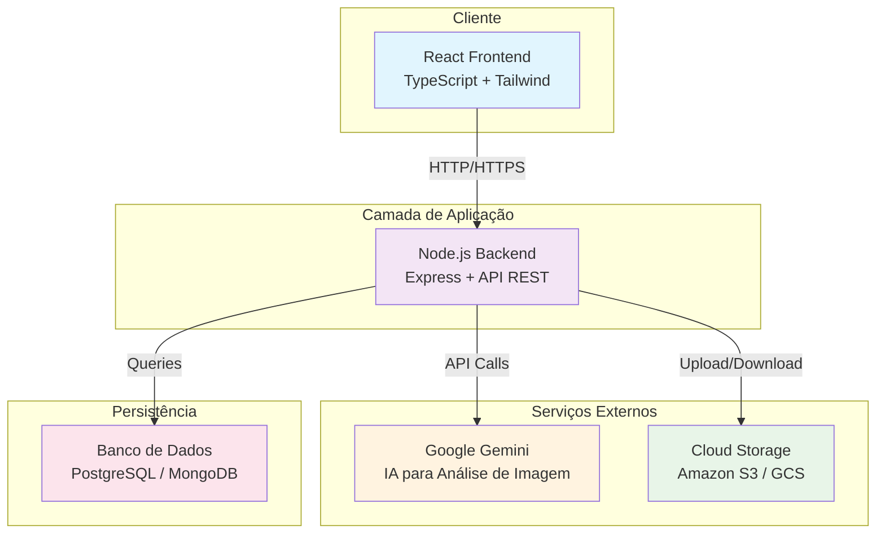

# InstaBytes: Uma Plataforma Social Aprimorada por Inteligência Artificial

**Transformando a maneira como compartilhamos e interagimos com conteúdo visual através da IA.**

---

## Abstract (Resumo Técnico)

O projeto **InstaBytes** aborda a crescente demanda por plataformas de compartilhamento de imagens que sejam mais inteligentes e interativas. Em um cenário onde a criação de conteúdo visual é vasta, a dificuldade em gerar descrições relevantes e envolventes para as imagens se torna um desafio significativo. InstaBytes propõe uma solução inovadora ao integrar inteligência artificial avançada para automatizar a geração de legendas e descrições de imagens, enriquecendo substancialmente a experiência do usuário e facilitando a descoberta de conteúdo. A metodologia principal envolve o uso de modelos de IA de última geração, como o Google Gemini, para analisar o conteúdo visual das imagens e gerar descrições textuais contextualmente relevantes, criativas e envolventes. A arquitetura utiliza React com TypeScript no frontend e Node.js no backend, garantindo uma experiência moderna e responsiva. Os resultados esperados incluem um aumento significativo no engajamento do usuário, uma melhor organização e categorização do conteúdo, e uma experiência de compartilhamento mais fluida e intuitiva. A contribuição central do InstaBytes reside na sua capacidade de democratizar a criação de conteúdo de alta qualidade, permitindo que usuários sem habilidades de escrita criativa produzam posts visualmente atraentes e textualmente ricos, revolucionando a forma como interagimos com mídias sociais baseadas em imagem.

## Badges Abrangentes

[](https://github.com/ESousa97/Instabytes-Front-End-Imersao-Alura-Google/blob/main/LICENSE)
[](https://github.com/ESousa97/Instabytes-Front-End-Imersao-Alura-Google)
[](https://github.com/ESousa97/Instabytes-Front-End-Imersao-Alura-Google/commits/main)
[](https://github.com/ESousa97/Instabytes-Front-End-Imersao-Alura-Google/issues)
[](https://github.com/ESousa97/Instabytes-Front-End-Imersao-Alura-Google/pulls)
[](https://github.com/ESousa97/Instabytes-Front-End-Imersao-Alura-Google)
[](https://github.com/ESousa97/Instabytes-Front-End-Imersao-Alura-Google/graphs/contributors)

## Sumário

*   [Introdução e Motivação](#introdução-e-motivação)
*   [🔗 Link Principal / Acesso ao Projeto](#-link-principal--acesso-ao-projeto)
*   [Arquitetura do Sistema](#arquitetura-do-sistema)
*   [Diagrama de Arquitetura](#diagrama-de-arquitetura)
*   [Decisões de Design Chave](#decisões-de-design-chave)
*   [✨ Funcionalidades Detalhadas (com Casos de Uso)](#-funcionalidades-detalhadas-com-casos-de-uso)
*   [🛠️ Tech Stack Detalhado](#%EF%B8%8F-tech-stack-detalhado)
*   [📂 Estrutura Detalhada do Código-Fonte](#-estrutura-detalhada-do-código-fonte)
*   [📋 Pré-requisitos Avançados](#-pré-requisitos-avançados)
*   [🚀 Guia de Instalação e Configuração Avançada](#-guia-de-instalação-e-configuração-avançada)
*   [⚙️ Uso Avançado e Exemplos](#%EF%B8%8F-uso-avançado-e-exemplos)
*   [🧪 Estratégia de Testes e Qualidade de Código](#-estratégia-de-testes-e-qualidade-de-código)
*   [🚢 Escalabilidade](#escalabilidade)
*   [📜 Licença e Aspectos Legais](#-licença-e-aspectos-legais)
*   [❓ FAQ (Perguntas Frequentes)](#-faq-perguntas-frequentes)
*   [📞 Contato e Suporte](#-contato-e-suporte)

---

## Introdução e Motivação

A ascensão das redes sociais e o compartilhamento constante de conteúdo visual criaram um ecossistema onde a atenção do usuário é um recurso valioso e disputado. No entanto, a criação de legendas e descrições de alta qualidade para imagens e vídeos pode ser demorada e desafiadora, especialmente para usuários que não possuem habilidades de escrita criativa. Essa dificuldade pode levar a posts com descrições genéricas, pouco envolventes ou até mesmo à ausência de texto, resultando em menor visibilidade, engajamento reduzido e experiências de usuário subótimas.

InstaBytes surge como uma solução tecnológica avançada para essa problemática, oferecendo uma plataforma que integra inteligência artificial de ponta para automatizar a geração de legendas e descrições de imagens. Ao aproveitar modelos de IA de última geração, como o Google Gemini, InstaBytes é capaz de analisar profundamente o conteúdo visual das imagens e gerar descrições textuais contextualmente relevantes, criativas e envolventes. Isso permite que os usuários produzam posts de alta qualidade de forma rápida e eficiente, aumentando significativamente o engajamento e a visibilidade de seu conteúdo.

A proposta de valor única do InstaBytes reside na sua capacidade de democratizar a criação de conteúdo de alta qualidade, permitindo que usuários de todos os níveis de habilidade produzam posts visualmente atraentes e textualmente ricos. Além disso, a integração de IA para geração de legendas abre novas possibilidades para a organização e descoberta de conteúdo, facilitando a busca por imagens e vídeos com base em suas características visuais e descrições textuais automaticamente geradas.

A motivação central para o desenvolvimento do InstaBytes é criar uma plataforma social mais inteligente, interativa e acessível, onde a IA atua como um parceiro criativo, capacitando os usuários a compartilhar suas histórias e experiências de forma mais eficaz e envolvente. Os objetivos de longo prazo incluem a expansão das capacidades de IA para incluir a geração de conteúdo de vídeo, a personalização de legendas com base nas preferências e estilo do usuário, e a integração seamless com outras plataformas de mídia social.

Esta demonstração oferece acesso à versão mais recente do projeto, permitindo que você carregue imagens, experimente a geração automática de legendas por IA, e explore todas as funcionalidades sociais da plataforma em tempo real.

## Arquitetura do Sistema

A arquitetura do InstaBytes é projetada seguindo princípios modernos de desenvolvimento web, sendo modular, escalável e resiliente, permitindo que a plataforma suporte um grande número de usuários simultâneos e um volume crescente de conteúdo visual. A arquitetura adota uma abordagem de separação clara entre frontend e backend, facilitando manutenção, escalabilidade e desenvolvimento independente de cada camada.

### Componentes Arquiteturais

A arquitetura é composta pelos seguintes componentes principais:

1. **Frontend (Interface do Usuário):** Implementado com React 18, TypeScript e Tailwind CSS, o frontend oferece uma interface moderna, interativa e totalmente responsiva. Utiliza hooks customizados para gerenciamento de estado, componentes reutilizáveis para consistência visual, e técnicas avançadas de otimização como lazy loading e code splitting.

2. **Backend (Servidor da Aplicação):** Construído com Node.js e Express, o backend atua como a camada intermediária robusta entre o frontend e os serviços externos. Gerencia autenticação, autorização, processamento de dados, upload de imagens, e orquestra as chamadas para serviços de IA.

3. **Serviço de IA (Google Gemini):** Integração direta com a API do Google Gemini para análise avançada de conteúdo visual e geração de descrições textuais contextualmente relevantes. O serviço processa imagens em tempo real e retorna descrições criativas e envolventes.

4. **Banco de Dados:** Sistema de persistência para armazenar metadados de posts, informações de usuário, comentários, curtidas e dados de interação. Suporta tanto bancos relacionais (PostgreSQL) quanto NoSQL (MongoDB) dependendo dos requisitos específicos.

5. **Armazenamento de Imagens:** Utiliza serviços de cloud storage como Amazon S3 ou Google Cloud Storage para armazenamento escalável e distribuído de imagens, garantindo alta disponibilidade e performance otimizada.

### Interações e Fluxo de Dados

O fluxo de dados segue um padrão de arquitetura RESTful com as seguintes interações principais:

*   **Upload de Imagem:** Frontend → Backend → Cloud Storage → Google Gemini → Backend → Frontend
*   **Visualização de Posts:** Frontend → Backend → Banco de Dados → Frontend
*   **Interações Sociais:** Frontend → Backend → Banco de Dados → Frontend (real-time via WebSockets futuro)

### Diagrama de Arquitetura



### Justificativas das Decisões Arquiteturais

A escolha de uma arquitetura modular foi motivada por diversos fatores estratégicos que garantem escalabilidade, manutenibilidade e performance otimizada:

*   **Separação de Responsabilidades:** Frontend focado em UX/UI, backend em lógica de negócio, serviços externos especializados em IA e storage
*   **Escalabilidade Independente:** Cada componente pode ser escalado individualmente conforme demanda
*   **Tecnologias Especializadas:** React para interfaces reativas, Node.js para performance, Google Gemini para IA avançada
*   **Manutenibilidade:** Código organizado em camadas bem definidas facilita updates e debugging
*   **Performance:** CDN para assets estáticos, cache inteligente, e processamento assíncrono de IA

## Decisões de Design Chave

As decisões de design técnico do InstaBytes foram cuidadosamente planejadas para criar uma experiência de usuário excepcional, performance otimizada e código maintível:

*   **React 18 com TypeScript:** Escolhido pela tipagem estática robusta, componentes reutilizáveis, hooks modernos, e ecossistema maduro. TypeScript elimina erros em tempo de compilação e melhora significativamente a experiência de desenvolvimento.

*   **Tailwind CSS:** Framework utility-first que permite desenvolvimento rápido, consistência visual automática, bundle size otimizado, e customização flexível. Elimina CSS desnecessário e garante design system coerente.

*   **Arquitetura de Componentes:** Estrutura modular com componentes especializados (Header, PostCard, UploadArea) que promove reutilização, testabilidade e manutenção simplificada.

*   **Hooks Customizados:** Implementação de hooks especializados (useTheme, usePosts, useNotification) para encapsular lógica complexa, facilitar reutilização e melhorar organização do código.

*   **Design System Consistente:** Paleta de cores gradiente (purple → pink → orange), tipografia Inter, componentes com estados visuais claros, e animações sutis que melhoram feedback visual.

*   **Responsividade Mobile-First:** Design que prioriza dispositivos móveis, com breakpoints bem definidos e experiência otimizada para touch interfaces.

*   **Tema Escuro Inteligente:** Implementação de dark mode com persistência local, detecção automática de preferências do sistema, e transições suaves entre temas.

## ✨ Funcionalidades Detalhadas (com Casos de Uso)

InstaBytes oferece um conjunto abrangente de funcionalidades modernas projetadas para maximizar engajamento e facilitar criação de conteúdo de alta qualidade:

### 1. Upload Inteligente de Imagens com IA

*   **Propósito:** Permitir upload de imagens com geração automática de descrições por IA, eliminando a necessidade de criação manual de legendas
*   **Funcionalidades:**
    *   Upload via drag & drop ou seleção de arquivo
    *   Validação automática de formato e tamanho
    *   Processamento em tempo real com Google Gemini
    *   Feedback visual durante processamento
    *   Geração de descrições contextualmente relevantes
*   **Casos de Uso:**
    *   **Usuário Casual:** Carrega foto de viagem sem saber como descrevê-la, recebe automaticamente: "Vista deslumbrante do pôr do sol sobre montanhas cobertas de neve, criando reflexos dourados no lago cristalino abaixo"
    *   **Criador de Conteúdo:** Upload em massa de fotos de produtos, cada uma recebe descrição única e detalhada automaticamente
    *   **Usuário com Deficiência Visual:** Imagens recebem descrições precisas que podem ser lidas por screen readers

### 2. Interface Social Moderna e Interativa

*   **Propósito:** Facilitar interações sociais autênticas com design intuitivo e responsivo
*   **Funcionalidades:**
    *   Sistema de curtidas com animações fluidas
    *   Comentários em tempo real com threads
    *   Compartilhamento nativo e via clipboard
    *   Modal de visualização imersiva
    *   Feed infinito com lazy loading
*   **Casos de Uso:**
    *   **Influencer:** Monitora engajamento em tempo real, responde comentários diretamente no modal expandido
    *   **Usuário Social:** Navega feed fluidamente, curte e comenta sem interrupções na experiência

### 3. Edição e Gerenciamento de Posts

*   **Propósito:** Permitir controle total sobre conteúdo publicado com interface intuitiva
*   **Funcionalidades:**
    *   Edição in-line de descrições
    *   Confirmação visual para ações destrutivas
    *   Histórico de modificações
    *   Validação de conteúdo em tempo real
*   **Casos de Uso:**
    *   **Correção Rápida:** Usuário identifica erro na descrição, edita diretamente no post sem recarregar página
    *   **Curadoria de Conteúdo:** Admin modera posts inadequados com confirmação dupla antes da exclusão

### 4. Experiência Responsiva e Acessível

*   **Propósito:** Garantir usabilidade excepcional em todos os dispositivos e para todos os usuários
*   **Funcionalidades:**
    *   Design mobile-first com breakpoints otimizados
    *   Suporte completo a screen readers
    *   Navegação por teclado
    *   Contraste adequado em modo claro/escuro
    *   Feedback tátil em dispositivos móveis
*   **Casos de Uso:**
    *   **Usuário Mobile:** Experiência completa em smartphone com gestos touch otimizados
    *   **Usuário com Necessidades Especiais:** Navegação completa via teclado e descrições de IA lidas por tecnologias assistivas

## 🛠️ Tech Stack Detalhado

| Categoria | Tecnologia | Versão Específica | Propósito no Projeto | Justificativa da Escolha |
|-----------|------------|-------------------|----------------------|-------------------------|
| **Frontend Core** | **React** | 18.3.1 | Framework principal para construção da interface reativa e componentizada | Ecossistema maduro, performance otimizada com React 18, hooks modernos, suspense, e concurrent features |
| **Linguagem** | **TypeScript** | 5.0+ | Tipagem estática, IntelliSense avançado, e redução de bugs em runtime | Type safety, melhor DX, refactoring seguro, e documentação automática via tipos |
| **Estilização** | **Tailwind CSS** | 3.4.17 | Framework utility-first para estilização rápida e consistente | Bundle size otimizado, design system integrado, responsividade nativa, e desenvolvimento ágil |
| **Build Tool** | **Vite** | 5.3.1 | Bundler moderno com HMR ultrarrápido e build otimizado | Startup instantâneo, HMR nativo, ESM support, e builds de produção otimizados |
| **HTTP Client** | **Axios** | 1.6.0 | Cliente HTTP com interceptors, timeout, e error handling robusto | Request/response interceptors, error handling centralizado, timeout configurável, e retry automático |
| **Ícones** | **Lucide React** | 0.263.1 | Biblioteca de ícones moderna, consistente e tree-shakeable | Ícones vetoriais otimizados, bundle size mínimo, design coerente, e fácil customização |
| **Runtime** | **Node.js** | 18+ | Ambiente de execução JavaScript para desenvolvimento e build | Performance V8, ESM support nativo, ecosystem npm robusto, e compatibilidade moderna |
| **Linting** | **ESLint** | 8.57.0 | Análise estática de código para manter qualidade e consistência | Rules customizáveis, integração IDE, auto-fix, e padrões de código consistentes |
| **CSS Processing** | **PostCSS** | 8.5.6 | Processamento avançado de CSS com autoprefixer e otimizações | Autoprefixing automático, otimizações de produção, e compatibilidade cross-browser |
| **Deploy** | **Vercel** | N/A | Plataforma de deploy com CI/CD automático e CDN global | Deploy automático do Git, preview deployments, edge functions, e performance otimizada |

### Arquitetura Tecnológica Justificada

**Stack Modern React:** A combinação React 18 + TypeScript + Vite representa o estado da arte em desenvolvimento frontend, oferecendo developer experience excepcional, performance de runtime otimizada, e maintabilidade a longo prazo. React 18 introduz concurrent features que melhoram responsividade, TypeScript elimina categorias inteiras de bugs, e Vite oferece feedback instantâneo durante desenvolvimento.

**Integração de IA:** A integração com Google Gemini via API REST permite processamento avançado de imagens sem complexidade adicional no frontend, mantendo a aplicação leve enquanto oferece capacidades de IA de última geração.

## 📂 Estrutura Detalhada do Código-Fonte

```
InstaBytes-Frontend/
├── 📄 index.html                      # HTML principal com SEO, PWA, e meta tags otimizadas
├── 🎨 tailwind.config.js              # Configuração Tailwind com tema customizado e animações
├── ⚙️ vite.config.ts                  # Configuração Vite com otimizações e plugins
├── 🔧 package.json                    # Dependências, scripts, e metadados do projeto
├── 📁 src/                            # Código-fonte principal da aplicação
│   ├── 🚀 main.tsx                    # Entry point com Error Boundary e configuração inicial
│   ├── 📱 App.tsx                     # Componente principal com state management e routing lógico
│   ├── 🎨 index.css                   # Estilos globais, animações, e tema dark/light
│   ├── 📁 components/                 # Componentes React reutilizáveis e especializados
│   │   ├── 🎯 Header.tsx              # Cabeçalho com navegação, tema, e upload button
│   │   ├── 📸 UploadArea.tsx          # Área de upload com drag&drop e feedback visual
│   │   ├── 📝 PostCard.tsx            # Card de post com interações sociais completas
│   │   ├── 🔍 PostModal.tsx           # Modal expandido para visualização detalhada
│   │   ├── 🔔 Notification.tsx        # Sistema de notificações toast com auto-dismiss
│   │   ├── ⚡ LoadingSpinner.tsx      # Spinner animado com indicadores de progresso
│   │   ├── 🎭 EmptyState.tsx          # Estado vazio com call-to-action engajante
│   │   ├── ⬆️ ScrollToTopButton.tsx   # Botão de scroll com smooth animation
│   │   └── ✅ ConfirmationModal.tsx   # Modal de confirmação para ações críticas
│   ├── 🪝 hooks/                      # Hooks customizados para lógica reutilizável
│   │   ├── 🎨 useTheme.ts             # Gerenciamento de tema com persistência local
│   │   ├── 📊 usePosts.ts             # State management completo para posts e API calls
│   │   └── 🔔 useNotification.ts      # Sistema de notificações com queue e auto-hide
│   ├── 🎯 types/                      # Definições TypeScript centralizadas
│   │   └── 📋 index.ts                # Interfaces, types, e props definitions
│   └── 🖼️ assets/                     # Assets estáticos otimizados
│       └── ⚛️ react.svg               # Ícones e imagens da aplicação
├── 📁 public/                         # Assets públicos servidos estaticamente
│   ├── 🌟 vite.svg                    # Favicon e ícones PWA
│   └── 📱 manifest.json               # Manifest PWA com configurações completas
├── 🔧 vercel.json                     # Configuração de deploy Vercel com otimizações
├── 📜 tsconfig.json                   # Configuração TypeScript com strict mode
├── 🔍 eslint.config.js                # Rules ESLint customizadas para qualidade
└── 📚 README.md                       # Documentação completa do projeto
```

**Detalhamento dos Componentes:**

- **`App.tsx`:** Orquestrador principal que gerencia estado global, routing lógico, e coordena interações entre componentes
- **`components/`:** Biblioteca de componentes React especializados, cada um com responsabilidade única e alta reutilização
- **`hooks/`:** Lógica de negócio encapsulada em hooks customizados para separação de concerns e testabilidade
- **`types/`:** Sistema de tipos TypeScript centralizado garantindo type safety em toda aplicação

### Sistema de Design Modular

Cada componente segue padrões consistentes de design e implementação:

```typescript
// Exemplo: Estrutura padrão de componente
interface ComponentProps {
  // Props tipadas com JSDoc
}

const Component: React.FC<ComponentProps> = ({ props }) => {
  // Hooks locais
  // Event handlers
  // Render com className sistemático
}

export default Component;
```

## 📋 Pré-requisitos Avançados

Para desenvolvimento e execução local do InstaBytes, são necessários os seguintes requisitos de sistema:

**Para Usuários Finais:**
*   **Navegador Moderno:** Chrome 90+, Firefox 88+, Safari 14+, ou Edge 90+ com suporte completo a ES2020+
*   **JavaScript Habilitado:** Essencial para funcionamento da SPA React
*   **Conexão de Internet:** Necessária para API calls e carregamento de imagens

**Para Desenvolvimento:**
*   **Node.js:** Versão 18.0.0+ (LTS recomendado) com suporte a ESM e top-level await
*   **NPM:** Versão 8.0.0+ ou Yarn 1.22+ para gerenciamento de dependências
*   **Git:** Versão 2.x para controle de versão e clonagem do repositório
*   **Editor de Código:** VS Code recomendado com extensões TypeScript e ESLint
*   **Sistema Operacional:** Windows 10+, macOS 10.15+, ou Linux (Ubuntu 20.04+)

**Extensões VS Code Recomendadas:**
*   TypeScript e JavaScript Language Features
*   ESLint para análise de código
*   Tailwind CSS IntelliSense
*   Auto Rename Tag
*   Prettier para formatação automática

## 🚀 Guia de Instalação e Configuração Avançada

### Instalação Básica

1.  **Clonar o Repositório:**
    ```bash
    git clone https://github.com/ESousa97/Instabytes-Front-End-Imersao-Alura-Google.git
    cd Instabytes-Front-End-Imersao-Alura-Google
    ```

2.  **Instalar Dependências:**
    ```bash
    npm install
    # ou
    yarn install
    ```

3.  **Configurar Variáveis de Ambiente:**
    ```bash
    # Criar arquivo .env.local
    VITE_API_URL=http://localhost:3000
    VITE_APP_NAME=InstaBytes
    VITE_MAX_FILE_SIZE=5242880  # 5MB
    ```

4.  **Executar em Desenvolvimento:**
    ```bash
    npm run dev
    # Aplicação estará disponível em http://localhost:8000
    ```

### Configuração de Produção

Para builds de produção otimizados:

```bash
# Build para produção
npm run build

# Preview do build local
npm run preview

# Análise do bundle (opcional)
npx vite-bundle-analyzer
```

### Configuração de Backend (Opcional)

Para desenvolvimento completo, configure o backend correspondente:

```bash
# Em diretório separado
git clone [URL_DO_BACKEND]
cd instabytes-backend
npm install
npm run dev  # Backend em http://localhost:3000
```

## ⚙️ Uso Avançado e Exemplos

### Navegação e Funcionalidades Principais

1.  **Upload de Imagens com IA:**
    - Arraste imagens para a área de upload ou clique para selecionar
    - Acompanhe o processamento IA em tempo real
    - Edite descrições geradas conforme necessário

2.  **Interações Sociais:**
    - Curta posts com feedback visual animado
    - Adicione comentários com validação em tempo real
    - Compartilhe via native share API ou clipboard

3.  **Personalização da Interface:**
    - Alterne entre modo claro/escuro no header
    - Navegação responsiva adapta-se automaticamente ao dispositivo
    - Scroll infinito carrega conteúdo sob demanda

### Customização Avançada

**Personalização de Tema:**

```css
/* tailwind.config.js - Cores customizadas */
module.exports = {
  theme: {
    extend: {
      colors: {
        brand: {
          primary: '#8B5CF6',
          secondary: '#EC4899',
          accent: '#F59E0B'
        }
      }
    }
  }
}
```

**Componente Personalizado:**

```typescript
// Exemplo: Extensão do PostCard
interface CustomPostCardProps extends PostCardProps {
  showAnalytics?: boolean;
  customTheme?: 'minimal' | 'vibrant';
}

const CustomPostCard: React.FC<CustomPostCardProps> = ({
  showAnalytics = false,
  customTheme = 'vibrant',
  ...props
}) => {
  const themeClasses = customTheme === 'minimal' 
    ? 'bg-gray-50 dark:bg-gray-900' 
    : 'bg-gradient-to-br from-purple-50 to-pink-50 dark:from-purple-900/20 dark:to-pink-900/20';

  return (
    <div className={`${themeClasses} rounded-xl`}>
      <PostCard {...props} />
      {showAnalytics && (
        <div className="p-4 border-t border-gray-200 dark:border-gray-700">
          <span className="text-sm text-gray-500">Views: 1.2k • Reach: 890</span>
        </div>
      )}
    </div>
  );
};
```

**Integração com API Externa:**

```typescript
// hooks/useExternalAPI.ts
import { useState, useCallback } from 'react';

export const useExternalAPI = () => {
  const [loading, setLoading] = useState(false);

  const shareToSocialMedia = useCallback(async (post: Post, platform: string) => {
    setLoading(true);
    try {
      const response = await fetch(`/api/share/${platform}`, {
        method: 'POST',
        headers: { 'Content-Type': 'application/json' },
        body: JSON.stringify({
          imageUrl: post.imgUrl,
          description: post.descricao,
          platform
        })
      });
      
      return await response.json();
    } finally {
      setLoading(false);
    }
  }, []);

  return { shareToSocialMedia, loading };
};
```

## 🧪 Estratégia de Testes e Qualidade de Código

### Tipos de Testes Implementados

1.  **Testes de Componentes:**
    *   **Propósito:** Verificar renderização correta, props handling, e interações do usuário
    *   **Ferramentas:** React Testing Library, Jest, e User Event para simulação de interações
    *   **Cobertura:** Todos os componentes principais com cenários de success e error
    *   **Foco:** Comportamento do usuário final, accessibility, e edge cases

2.  **Testes de Hooks Customizados:**
    *   **Propósito:** Validar lógica de estado, efeitos colaterais, e API calls
    *   **Ferramentas:** @testing-library/react-hooks para isolamento de hooks
    *   **Foco:** State transitions, error handling, e cleanup correto

3.  **Testes de Integração:**
    *   **Propósito:** Verificar fluxos completos de usuário end-to-end
    *   **Ferramentas:** Cypress para automação de browser real
    *   **Cenários:** Upload de imagem → Processamento IA → Publicação → Interações

4.  **Testes Visuais e de Responsividade:**
    *   **Propósito:** Garantir consistência visual e adaptação a diferentes viewports
    *   **Ferramentas:** Storybook para component library e Percy para visual regression
    *   **Foco:** Design system, dark mode, e breakpoints responsivos

### Qualidade de Código e CI/CD

*   **Linting Avançado:** ESLint com rules customizadas para React/TypeScript, Prettier para formatação consistente
*   **Type Safety:** TypeScript em modo strict com verificação rigorosa de tipos
*   **Pre-commit Hooks:** Husky + lint-staged para validação automática antes de commits
*   **CI/CD Pipeline:** GitHub Actions para testes automáticos, build verification, e deploy
*   **Code Coverage:** Monitoramento de cobertura com thresholds mínimos de 80%
*   **Bundle Analysis:** Análise automática de bundle size e performance metrics

**Configuração de Teste:**

```json
// package.json - Scripts de teste
{
  "scripts": {
    "test": "vitest",
    "test:ui": "vitest --ui",
    "test:coverage": "vitest --coverage",
    "test:e2e": "cypress run",
    "test:visual": "percy exec -- cypress run"
  }
}
```

## 🚢 Escalabilidade

A arquitetura do InstaBytes é projetada para escalabilidade horizontal e vertical:

*   **Frontend Scaling:**
    *   CDN global da Vercel com edge caching
    *   Static assets distribuídos geograficamente
    *   Lazy loading e code splitting reduzem initial bundle
    *   Service Worker para caching inteligente (futuro)

*   **Performance Optimizations:**
    *   Image optimization automática via Vercel Image API
    *   Preloading de recursos críticos
    *   Bundle size monitoring com alerts automáticos
    *   Core Web Vitals tracking contínuo

*   **Monitoramento e Observabilidade:**
    *   Real User Monitoring (RUM) via Vercel Analytics
    *   Error tracking e performance metrics
    *   A/B testing capabilities para feature rollouts
    *   Alertas automáticos para degradação de performance

## 📜 Licença e Aspectos Legais

O projeto **InstaBytes** é distribuído sob a **Licença MIT**, uma das licenças de software livre mais permissivas e amplamente adotadas na indústria.

### Principais Implicações da Licença MIT:

*   **Uso Comercial:** Permitido uso em projetos comerciais sem restrições
*   **Modificação:** Liberdade total para modificar o código-fonte conforme necessidades
*   **Distribuição:** Pode ser redistribuído livremente, incluindo em produtos proprietários
*   **Sublicenciamento:** Permite sublicenciar sob termos diferentes se necessário
*   **Uso Privado:** Uso interno em organizações sem obrigação de divulgação
*   **Sem Garantias:** Software fornecido "como está" sem garantias expressas ou implícitas
*   **Atribuição Obrigatória:** Deve manter o aviso de copyright e licença em todas as cópias

Para o texto completo da licença, consulte o arquivo `LICENSE` no repositório:

[📜 Visualizar Licença MIT Completa](./LICENSE)

**Considerações Legais Adicionais:**
*   Integração com APIs terceirizadas (Google Gemini) sujeita aos termos de serviço respectivos
*   Dados de usuário processados conforme políticas de privacidade aplicáveis
*   Uso de bibliotecas open source com licenças compatíveis verificadas

## ❓ FAQ (Perguntas Frequentes)

**P: O que é o InstaBytes e como ele se diferencia de outras redes sociais?**
**R:** O InstaBytes é uma plataforma social focada em compartilhamento de imagens que utiliza inteligência artificial avançada (Google Gemini) para gerar automaticamente descrições criativas e contextualmente relevantes para suas fotos. Diferente de outras plataformas, elimina a dificuldade de criar legendas envolventes, democratizando a criação de conteúdo de alta qualidade.

**P: Como funciona a geração automática de legendas por IA?**
**R:** Quando você faz upload de uma imagem, ela é enviada para a API do Google Gemini que analisa o conteúdo visual, identifica objetos, cenários, emoções e contexto, gerando uma descrição textual criativa e envolvente. Todo o processo acontece em tempo real, geralmente em poucos segundos.

**P: É necessário pagar para usar o InstaBytes?**
**R:** Não, o InstaBytes é uma aplicação open source e completamente gratuita. Você pode acessar a versão online, fazer fork do código, ou executar localmente sem custos. As únicas limitações podem vir dos serviços de IA utilizados (Google Gemini) conforme seus próprios limites de uso.

**P: Quais formatos de imagem são suportados?**
**R:** O InstaBytes suporta os principais formatos de imagem: JPEG, PNG, GIF, e WEBP. O tamanho máximo por arquivo é de 5MB para garantir upload rápido e processamento eficiente pela IA.

**P: Como posso contribuir para o desenvolvimento do projeto?**
**R:** Você pode contribuir de várias formas: reportando bugs via GitHub Issues, sugerindo novas funcionalidades, fazendo fork e criando Pull Requests com melhorias, ou ajudando na documentação. O projeto segue práticas de código aberto e welcomes all contributions.

**P: O InstaBytes funciona offline?**
**R:** Parcialmente. A interface principal funciona offline após o primeiro carregamento, mas funcionalidades que dependem de API (upload de imagens, geração de IA, sincronização de posts) requerem conexão de internet. Implementação de Service Worker para melhor suporte offline está planejada.

**P: É possível integrar o InstaBytes com outras redes sociais?**
**R:** Atualmente o InstaBytes oferece compartilhamento básico via Web Share API. Integração direta com APIs de outras redes sociais (Instagram, Twitter, Facebook) está no roadmap de desenvolvimento futuro.

**P: Como são tratados os dados de privacidade dos usuários?**
**R:** O InstaBytes processa apenas os dados necessários para funcionamento (imagens para análise de IA, posts e comentários). Não armazena dados pessoais sensíveis e segue melhores práticas de privacy by design. Images são processadas temporariamente pela IA e metadados são armazenados de forma segura.

## 📞 Contato e Suporte

Para dúvidas técnicas, reportar problemas, sugerir melhorias, ou colaborar no desenvolvimento do InstaBytes, utilize os seguintes canais:

*   **GitHub Issues:**
    Canal preferencial para bugs, feature requests, e discussões técnicas sobre o projeto.
    *   [🐛 Reportar Bug](https://github.com/ESousa97/Instabytes-Front-End-Imersao-Alura-Google/issues/new?template=bug_report.md)
    *   [✨ Sugerir Feature](https://github.com/ESousa97/Instabytes-Front-End-Imersao-Alura-Google/issues/new?template=feature_request.md)
    *   [💬 Ver Discussões Abertas](https://github.com/ESousa97/Instabytes-Front-End-Imersao-Alura-Google/issues)

*   **Pull Requests:**
    Para contribuições diretas de código, melhorias, e correções.
    *   [🔧 Abrir Pull Request](https://github.com/ESousa97/Instabytes-Front-End-Imersao-Alura-Google/compare)
    *   [📋 Ver PRs Pendentes](https://github.com/ESousa97/Instabytes-Front-End-Imersao-Alura-Google/pulls)

*   **Contato Direto (Desenvolvedor Principal):**
    Para questões específicas, colaborações, ou contato profissional.
    *   **GitHub:** [@ESousa97](https://github.com/ESousa97)
    *   **LinkedIn:** [José Enoque Sousa](https://www.linkedin.com/in/enoque-sousa-bb89aa168/)
    *   **Portfolio:** [Projetos e Experiências](https://github.com/ESousa97)

---

<p align="center">
  
  
</p>

<p align="center">
  <em>Desenvolvido com ❤️ por José Enoque Sousa - Revolucionando redes sociais através da democratização de conteúdo de qualidade com Inteligência Artificial</em>
</p>

Agradecemos seu interesse no InstaBytes e estamos ansiosos para ver como a comunidade utilizará e expandirá esta plataforma para criar experiências ainda mais incríveis de compartilhamento social potencializado por IA.

> ✨ **Criado em:** 24 de nov. de 2024 às 21:55 - Transformando a criação de conteúdo visual através da inteligência artificial
